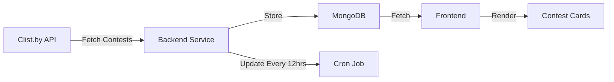
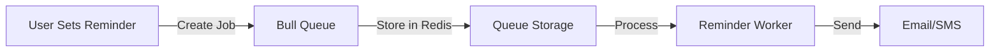
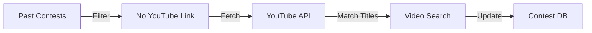

# Contest Tracker

A full-stack web application that helps competitive programmers track coding contests from Codeforces, CodeChef, and LeetCode. Built with the MERN stack (MongoDB, Express.js, React.js, Node.js).

## Demo Video

Watch a complete demo of the Contest Tracker application:
[Demo Video](https://drive.google.com/file/d/1uBu8SGJzh6wjZJh51O1NboAGTWnUZqjz/view?usp=drive_link)

## Table of Contents
- [Features](#features)
  - [Core Features](#core-features)
  - [Technical Features](#technical-features)
- [Tech Stack](#tech-stack)
  - [Frontend](#frontend)
  - [Backend](#backend)
  - [APIs Used](#apis-used)
- [Data Flows](#data-flows)
  - [Contest Loading and Rendering](#1-contest-loading-and-rendering)
  - [Reminder System](#2-reminder-system)
  - [YouTube Solution Links](#3-youtube-solution-links)
- [Database Schema](#database-schema)
  - [Contest Model](#contest-model)
  - [User Model](#user-model)
  - [Reminder Model](#reminder-model)
- [Screenshots](#screenshots)
- [Getting Started](#getting-started)
  - [Prerequisites](#prerequisites)
  - [Installation](#installation)
- [API Endpoints](#api-endpoints)
  - [Contest Routes](#contest-routes)
  - [Authentication Routes](#authentication-routes)
  - [Reminder Routes](#reminder-routes)
- [Project Structure](#project-structure)
- [Contributing](#contributing)
- [License](#license)
- [Acknowledgments](#acknowledgments)
- [Contact](#contact)

## Features

### Core Features
- 📅 Real-time contest tracking from multiple platforms
  - Codeforces
  - Codechef
  - LeetCode
- ⏰ Time remaining countdown for upcoming contests
- 📱 Platform filtering system
- 🔖 Contest bookmarking system
- 📺 YouTube solution links for past contests
- 🌓 Light/Dark mode toggle
- 📱 Mobile and tablet responsive design
- 🔔 Email and SMS reminders for contests

### Technical Features
- Automated contest updates every 12 hours
- Automatic YouTube solution link fetching
- Real-time contest status updates
- User authentication system
- Email and SMS reminders for contests
- RESTful API architecture

## Tech Stack

### Frontend
- React.js
- Material-UI
- Context API for state management
- Axios for API calls

### Backend
- Node.js
- Express.js
- MongoDB
- Bull Queue for job processing
- Node-cron for scheduled tasks
- JWT for authentication

### APIs Used
- Clist.by API for contest data
- YouTube Data API for solution videos
- SendGrid for email notifications
- Twilio for SMS notifications
## Data Flows

### 1. Contest Loading and Rendering


- Fetches contest data from Clist.by API
- Stores contests in MongoDB with proper categorization (upcoming/past)
- Updates automatically every 12 hours via cron job
- Frontend fetches and displays contests with real-time countdown
- Supports platform filtering and sorting

### 2. Reminder System


- Uses Bull Queue with Redis for reliable job processing
- Stores reminder jobs with calculated delays
- ReminderWorker processes jobs when contest time approaches
- Supports both email (SendGrid) and SMS (Twilio) notifications
- Persists reminders even if server crashes

### 3. YouTube Solution Links


- Automatically fetches past contests without YouTube links
- Uses YouTube Data API to search for solution videos
- Matches contest titles with video titles using custom cleaning logic
- Updates contest records with matched video links
- Runs every 12 hours via cron job

## Database Schema

### Contest Model
```javascript
{
    name: String,          // Contest name
    resource: String,      // Platform (codeforces.com, codechef.com, leetcode.com)
    start: Date,          // Contest start time
    end: Date,            // Contest end time
    href: String,         // Contest URL
    type: String,         // "upcoming" or "past"
    ytlink: String        // YouTube solution link (optional)
}
```

### User Model
```javascript
{
    name: String,
    email: String,
    password: String,
    contactNo: String,
    bookmarkedContests: [ObjectId],  // References to Contest documents
    reminders: [ObjectId]            // References to Reminder documents
}
```

### Reminder Model
```javascript
{
    userId: ObjectId,     // Reference to User
    contestId: ObjectId,  // Reference to Contest
    reminderTime: Date,   // When to send reminder
    type: String,         // "email" or "sms"
    sent: Boolean         // Whether reminder was sent
}
```

## Screenshots

### Home Page
[Add screenshot of the home page showing upcoming and past contests]

### Contest Card
[Add screenshot of a contest card showing time remaining and bookmark option]

### Reminder Settings
[Add screenshot of the reminder settings modal]

### YouTube Link Management
[Add screenshot of the admin interface for managing YouTube links]

### Mobile View
[Add screenshot of the mobile-responsive design]

## Getting Started

### Prerequisites
- Node.js (v14 or higher)
- MongoDB
- npm or yarn
- YouTube API Key
- Clist.by API credentials
- SendGrid API Key (for email notifications)
- Twilio credentials (for SMS notifications)

### Installation

1. Clone the repository
```bash
git clone https://github.com/yourusername/contest-tracker.git
cd contest-tracker
```

2. Install dependencies
```bash
# Install backend dependencies
cd backend
npm install

# Install frontend dependencies
cd ../frontend
npm install
```

3. Set up environment variables
Create a `.env` file in the backend directory with the following variables:
```env
PORT=5000
MONGODB_URI=your_mongodb_uri
JWT_SECRET=your_jwt_secret
CLIST_USERNAME=your_clist_username
CLIST_API_KEY=your_clist_api_key
YT_API_KEY=your_youtube_api_key
SENDGRID_API_KEY=your_sendgrid_api_key
TWILIO_ACCOUNT_SID=your_twilio_sid
TWILIO_AUTH_TOKEN=your_twilio_token
TWILIO_PHONE_NUMBER=your_twilio_phone
```

4. Start the development servers
```bash
# Start backend server
cd backend
npm run dev

# Start frontend server
cd frontend
npm run dev
```

## API Endpoints

### Contest Routes
- `GET /contests` - Get all contests (upcoming and past)
- `GET /contests/upcoming` - Get upcoming contests
- `GET /contests/past` - Get past contests
- `GET /contests/bookmarks` - Get user's bookmarked contests
- `POST /contests/bookmark/:id` - Bookmark a contest
- `DELETE /contests/unbookmark/:id` - Remove contest bookmark

### Authentication Routes
- `POST /auth/register` - Register a new user
- `POST /auth/login` - Login user
- `GET /auth/profile` - Get user profile

### Reminder Routes
- `GET /contests/reminders` - Get user's contest reminders
- `POST /contests/reminder/:contestId` - Set a contest reminder
- `DELETE /contests/reminder/:contestId` - Remove a contest reminder

## Project Structure

```
contest-tracker/
├── backend/
│   ├── config/
│   ├── middleware/
│   ├── models/
│   ├── routes/
│   ├── services/
│   └── server.js
└── frontend/
    ├── public/
    ├── src/
    │   ├── components/
    │   ├── context/
    │   ├── pages/
    │   └── App.jsx
    └── package.json
```

## Contributing

1. Fork the repository
2. Create your feature branch (`git checkout -b feature/AmazingFeature`)
3. Commit your changes (`git commit -m 'Add some AmazingFeature'`)
4. Push to the branch (`git push origin feature/AmazingFeature`)
5. Open a Pull Request

## License

This project is licensed under the MIT License - see the LICENSE file for details.

## Acknowledgments

- [Clist.by](https://clist.by/) for providing contest data
- [Material-UI](https://mui.com/) for the UI components
- [TLE Eliminators](https://www.tle-eliminators.com/) for the YouTube solution videos

## Contact

Aditya Dubey - [LinkedIn](linkedin.com/in/aditya-dubey-7263b7200/) - dubey02.adity@gmail.com

Project Link: [https://github.com/yourusername/contest-tracker](https://github.com/yourusername/contest-tracker) 
